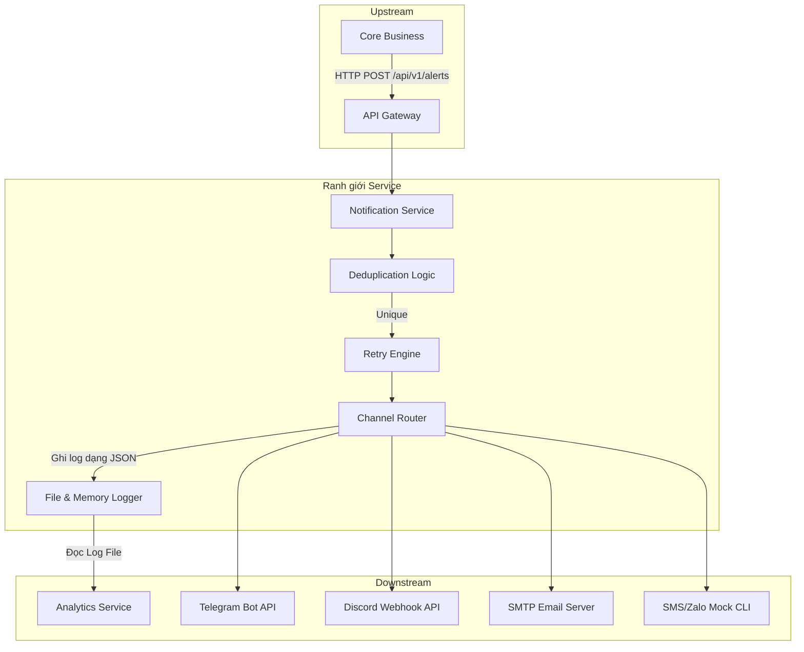

# Service Boundary - Notification Service

Tài liệu này xác định ranh giới chức năng (Service Boundary), trách nhiệm và phạm vi hoạt động của Notification Service trong hệ thống.

---

## 1. Ranh giới và Trách nhiệm (Responsibilities)

### Chức năng nằm trong phạm vi (In-Scope)
* **Tiếp nhận Cảnh báo**: Nhận dữ liệu đầu vào qua giao thức HTTP REST từ hệ thống Core Business hoặc qua API Gateway chung.
* **Chống trùng lặp (Deduplication)**: Ngăn ngừa spam cảnh báo bằng cách theo dõi danh sách `alert_id` nhận được trong khoảng thời gian TTL cấu hình sẵn. Nếu trùng sẽ bỏ qua và đánh dấu trạng thái tương ứng.
* **Cơ chế Thử lại (Retry Mechanism)**: Tự động thử lại theo cơ chế Exponential Backoff (chờ trễ lũy thừa) khi gửi tới các dịch vụ bên ngoài (Telegram, Discord, Email) bị thất bại tạm thời (timeout, mất mạng).
* **Phân tuyến Kênh thông báo (Channel Routing)**: Đọc thông tin yêu cầu gửi kênh hoặc phân phối tới tất cả các kênh đang hoạt động.
* **Chuẩn hóa thông điệp**: Biến đổi payload thô nhận được từ Core Business thành định dạng hiển thị phù hợp với từng kênh riêng biệt (ví dụ: định dạng Markdown cho Telegram, định dạng Rich Embed cho Discord, định dạng Plain Text/HTML cho Email).
* **Ghi nhận nhật ký trạng thái (Logging)**: Xuất nhật ký lịch sử gửi tin ra console và ghi file định dạng JSON có cấu trúc để phục vụ hoạt động đồng bộ của Analytics Service.

### Chức năng nằm ngoài phạm vi (Out-of-Scope)
* **Phát hiện sự kiện lạ**: Việc phân tích camera, phát hiện chuyển động hoặc lỗi phần mềm là trách nhiệm của Core Business, không thuộc Notification Service.
* **Quản lý danh sách người dùng**: Notification Service chỉ nhận định dạng nhóm đích (`target`) như `security_team` hoặc `admin` và gửi tới cấu hình tương ứng được cài đặt sẵn, không quản lý thông tin hồ sơ chi tiết người dùng.
* **Phân tích và Tổng hợp biểu đồ dài hạn**: Việc phân tích xu hướng cảnh báo, lập báo cáo tuần/tháng thuộc trách nhiệm của Analytics Service (thông qua thu thập log từ Notification Service).
* **Leo thang cảnh báo nâng cao (Escalation)**: Cơ chế nếu không ai phản hồi alert sau 5 phút thì gửi lại cho cấp cao hơn không được thực hiện ở phiên bản cơ bản này.

---

## 2. Giao thức kết nối và Tương tác (Interactions)

### Upstream (Tương tác Đầu vào)
* **Giao thức**: HTTP/1.1 REST API.
* **Định dạng dữ liệu**: JSON.
* **Authentication**: Hỗ trợ xác thực bằng API Key ở mức API Gateway (nếu có).

### Downstream (Tương tác Đầu ra)
* **Telegram Bot**: Gọi HTTPS POST trực tiếp tới endpoint Telegram Bot API công khai.
* **Discord Webhook**: Gọi HTTPS POST trực tiếp tới webhook URL do server quản trị của Discord cấp.
* **SMTP Email**: Tạo kết nối TCP trực tiếp tới Server SMTP của các nhà cung cấp (Gmail, Outlook, Amazon SES) bằng thư viện `smtplib` bảo mật qua SSL (port 465) hoặc TLS (port 587).
* **Analytics Service**: Đọc và thu gom log bất đồng bộ thông qua tệp tin log JSON tĩnh `/app/evidence/logs/notification_service.log` được ghi ra bởi thư viện logger của hệ thống.
